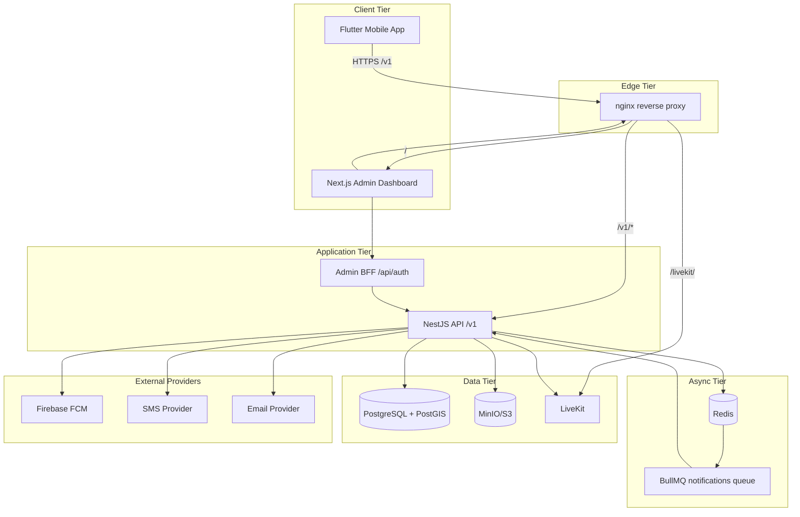
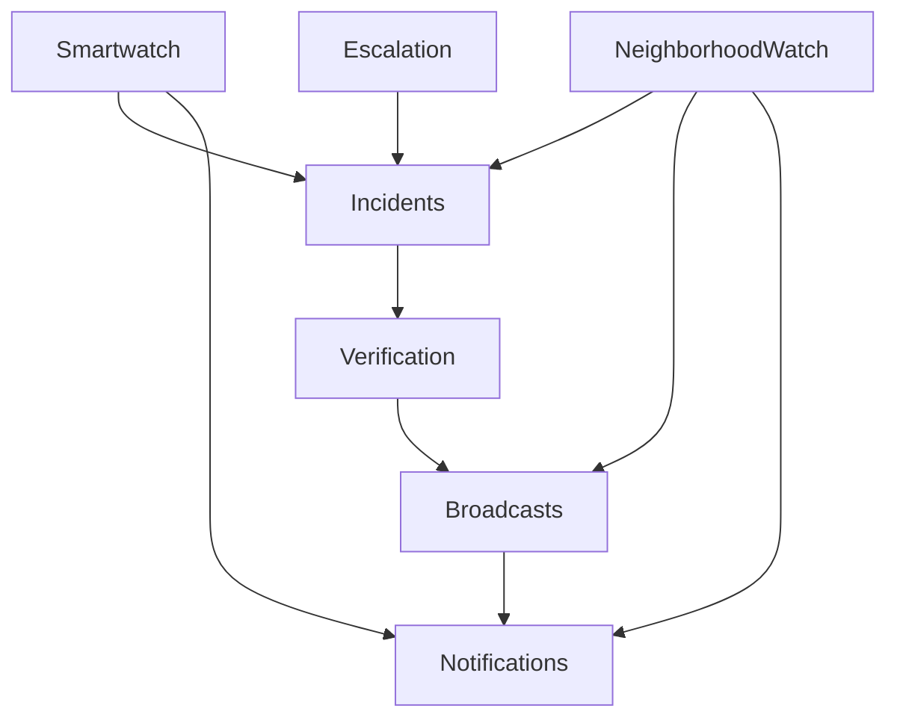
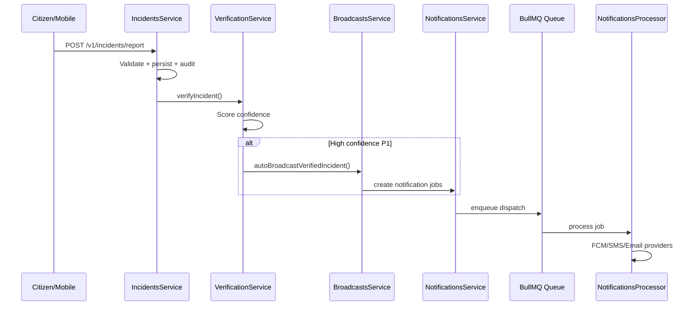
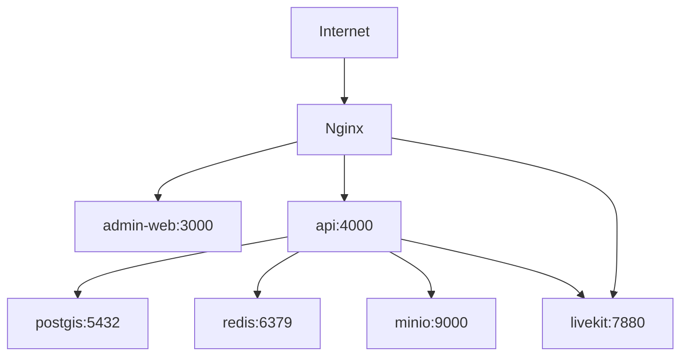

# THE EYE — Principal Architecture Review

**Date:** 2026-07-10  
**Reviewer role:** Principal Software Architect  
**Scope:** Full monorepo — no new features, boundary and maintainability assessment

---

## Executive summary

THE EYE is a **pnpm monorepo** with a well-structured **NestJS API**, a **Next.js admin dashboard**, a **Flutter mobile client** (outside workspace), and **Docker/nginx infrastructure**. Domain boundaries are generally sound: incidents flow through verification → broadcast → notifications with acyclic module dependencies.

**Strengths:** Clear `/v1` API versioning, shared RBAC package, tamper-evident audit chain, PostGIS data model, production-ready infra scripts, 88 backend tests.

**Primary risks:** Three sources of truth for enums (shared / Prisma / admin views), mobile monolith outside workspace, hybrid admin data layer (API + mock + placeholders), Docker uses npm while dev uses pnpm.

**Refactor applied this review:** Aligned `AdminRoleName` in `@the-eye/shared` with admin-web (added `Community Moderator`), removed duplicate `roleScope` from `mock-data.ts`.

---

## 1. Project structure

```
the-eye-monorepo/
├── apps/
│   ├── api/           NestJS + Prisma + PostGIS
│   ├── admin-web/     Next.js 15 App Router
│   └── mobile/        Flutter (NOT in pnpm workspace)
├── packages/
│   └── shared/        Domain enums, permissions, RBAC maps
├── infra/docker/      Compose, nginx, pgbouncer, observability
├── scripts/           Smoke tests, k6, deploy, backup
└── docs/              Architecture, ops, UX, performance
```

| Layer | Technology | Maturity |
|-------|------------|----------|
| API | NestJS 10, Prisma 6, BullMQ | Production-oriented |
| Admin | Next.js 15, RSC, middleware JWT | Production-oriented |
| Mobile | Flutter 3.5, single `main.dart` | Prototype |
| Infra | Docker Compose, nginx, PostGIS, Redis, MinIO, LiveKit | Production-oriented |

---

## 2. System context diagram



---

## 3. Monorepo organization

### Workspace members (`pnpm-workspace.yaml`)

| Package | Name | Role |
|---------|------|------|
| `apps/api` | `@the-eye/api` | Backend service |
| `apps/admin-web` | `@the-eye/admin-web` | Admin SSR app |
| `packages/shared` | `@the-eye/shared` | Cross-cutting domain contracts |

### Orchestration

- **Package manager:** pnpm (workspace filters, `pnpm -r`)
- **Build orchestration:** Root scripts — no Turborepo
- **Not in workspace:** `apps/mobile` — tested via static smoke script only

### Dependency graph

```mermaid
graph LR
  Shared[@the-eye/shared]
  API[@the-eye/api]
  Admin[@the-eye/admin-web]
  Mobile[apps/mobile]

  API --> Shared
  Admin --> Shared
  Admin -->|HTTP Bearer JWT| API
  Mobile -->|HTTP /v1| API
```

---

## 4. Modular boundaries — API

### NestJS module map (15 domain + 3 cross-cutting)

| Module | Responsibility | Key dependencies |
|--------|----------------|------------------|
| `AuthModule` | JWT, refresh, admin/citizen login | Prisma, shared RBAC |
| `UsersModule` | Directory, scoped queries | Prisma, shared |
| `IncidentsModule` | Report, lifecycle, assignment | Verification, Prisma |
| `VerificationModule` | Confidence scoring, crowd confirm | Broadcasts, Prisma |
| `BroadcastsModule` | Draft, approve, geofence publish | Notifications, Prisma |
| `NotificationsModule` | Enqueue + dispatch (BullMQ) | Prisma, providers |
| `EscalationModule` | Rule-based escalation | Incidents, Prisma |
| `AuditModule` | Hash-chain append-only ledger | Prisma |
| `StorageModule` | S3 presign, evidence keys | S3 |
| `LiveVideoModule` | LiveKit rooms, GPS trail | Prisma, LiveKit |
| `SmartwatchModule` | Pair, SOS, GPS, heartbeat | Incidents, Notifications |
| `NeighborhoodWatchModule` | Communities, posts, patrols | Incidents, Broadcasts |
| `PoliceStationsModule` | Nearest station queries | PostGIS |
| `HealthModule` | Liveness/readiness | Prisma, Redis |
| `MetricsModule` | Prometheus exposition | Global |
| `RateLimitModule` | Redis sliding window | Global |

### Module dependency diagram (acyclic)



**No circular imports detected.** No `forwardRef()` usage.

### Boundary observations

| Pattern | Assessment |
|---------|------------|
| `PrismaModule` `@Global()` | Convenient but weakens domain encapsulation — any service can bypass repositories |
| Guards duplicated across modules | `JwtAuthGuard` / `PermissionsGuard` re-provided in ~10 modules — candidate for `AuthGuardsModule` |
| Verification → Broadcasts direct call | Acceptable for now; consider domain events if fan-out grows |
| DTO validation split | Auth uses class-validator; other modules use manual validators — inconsistent |

---

## 5. Service responsibilities & event flow

### Incident lifecycle (synchronous core)



### Async infrastructure

| Component | Queue / store | Status |
|-----------|---------------|--------|
| Notification dispatch | BullMQ `notifications` | **Implemented** |
| Rate limiting | Redis (ioredis) | **Implemented** |
| Auth user cache | In-memory Map | **Implemented** (not Redis) |
| Escalation timers | — | **Not queue-backed** (doc corrected) |
| Broadcast fanout | — | Synchronous path |
| Evidence processing | — | **Not queued** |

---

## 6. API contracts

### Versioning

- Global prefix: `/v1` (excludes `/metrics`)
- Swagger: `/docs`
- Nginx routes `/v1/*` → API, blocks `/metrics` and `/docs` externally

### Contract layers

| Layer | Location | Consumers |
|-------|----------|-----------|
| Domain enums | `packages/shared` | API (primary) |
| DB enums | `prisma/schema.prisma` | API persistence |
| DTOs | `apps/api/src/modules/*/*.dto.ts` | HTTP boundary |
| Admin view models | `admin-web/lib/types/admin-views.ts` | SSR presentation |
| Admin mappers | `admin-web/lib/mappers/` | API JSON → views |

### Contract gap

- **No OpenAPI-generated client** — admin uses hand-written mappers; mobile uses string paths in `main.dart`
- **Priority/status shorthand** — admin shows `P1` while API uses `P1LifeThreatening` (mapper handles this)

---

## 7. Shared packages

### `@the-eye/shared` exports

- Enums: `UserRole`, `AdminRoleName`, `IncidentType`, `IncidentStatus`, `IncidentPriority`, `BroadcastType`, `BroadcastStatus`, `CommunityRoleName`
- Type: `Permission` union
- Maps: `adminRolePermissions`, `userRolePermissions`, `rolePermissions`

### Consumption

| Consumer | Usage |
|----------|-------|
| API | Heavy — guards, services, DTOs, lifecycle |
| Admin-web | **Now wired** — `AdminRole` = `AdminRoleName` |
| Mobile | None |

---

## 8. Admin dashboard architecture

```mermaid
flowchart LR
  subgraph next [Next.js App Router]
    MW[middleware.ts JWT gate]
    Pages[Server Components]
    BFF[/api/auth/login logout]
    Client[Client Components]
  end

  subgraph lib [lib/]
    Data[data.ts fetchers]
    Client2[api/client.ts]
    Mappers[mappers/]
    Views[types/admin-views.ts]
    Session[session.ts + verify-jwt.ts]
  end

  MW --> Pages
  Pages --> Data
  Data --> Client2
  Client2 -->|Bearer token| API[NestJS /v1]
  BFF --> API
  Data --> Mappers --> Views
```

### Data source split

| Source | ~Pages | Risk |
|--------|--------|------|
| Live API (`lib/api/data.ts`) | 28 | Low |
| Mock (`lib/mock-data.ts`) | 6 | Medium — drift from API |
| Hardcoded placeholders | 4 | High — no backend |

---

## 9. Mobile architecture

- **Single file:** `main.dart` (~2200 lines) — all routes, state, API, widgets
- **Not in pnpm workspace** — no shared type consumption
- **Contract enforcement:** `scripts/mobile-smoke-test.cjs` (static string checks)
- **Dependencies declared but unused:** `livekit_client`, `google_maps_flutter`, `firebase_messaging`

---

## 10. Infrastructure



Profiles: `pooling` (PgBouncer), `observability` (Prometheus), `certbot` (TLS)

---

## 11. Test architecture

| Suite | Runner | Count | Coverage focus |
|-------|--------|-------|----------------|
| API unit/integration | Custom `test-runner.ts` | 88 tests | Domain services, guards, wiring |
| Admin | Build smoke only | — | Production build |
| Mobile | Static smoke | — | Route/API string presence |
| k6 | External | 10+ scenarios | Load/scale validation |
| CI | GitHub Actions | Postgres + Redis services | Backend + smoke chain |

**Note:** Jest is in devDependencies but CI uses custom runner — tooling duplication.

---

## 12. Refactoring performed (minimal)

| Change | Rationale |
|--------|-----------|
| Added `CommunityModerator` to `AdminRoleName` + permissions in `@the-eye/shared` | Closed enum drift — admin had role API lacked |
| `admin-views.ts` imports `AdminRoleName` as canonical `AdminRole` | Single source of truth for RBAC labels |
| Removed duplicate `roleScope` from `mock-data.ts` | DRY — re-export from `admin-views` |
| `nav-access.ts` uses `AdminRoleName` enum keys | Type-safe route ACL |
| Corrected `docs/architecture.md` async claims | Doc matched actual implementation |

**Not refactored (deferred):** Flutter file split, Docker pnpm migration, OpenAPI client generation, mock-data elimination, AuthGuardsModule extraction.

---

## 13. Maintainability scorecard

| Dimension | Score | Notes |
|-----------|-------|-------|
| Modularity (API) | **B+** | Clean module graph; global Prisma weakens boundaries |
| Contract consistency | **C+** | Shared package underused until this review |
| Testability | **B** | Strong API tests; thin admin/mobile coverage |
| Deployability | **A-** | Docker, nginx, CI, backup scripts |
| Scalability path | **B** | Metrics, rate limits, k6 profiles ready |
| Onboarding clarity | **B-** | Good docs; mobile monolith hurts |
| Technical debt trend | **Stable** | Debt documented; no uncontrolled growth |

---

## 14. Long-term maintainability recommendations

See [`TECHNICAL_DEBT_REPORT.md`](./TECHNICAL_DEBT_REPORT.md) for prioritized backlog.

### Tier 1 — Next quarter

1. **Adopt `@the-eye/shared` in admin mappers** for priority/status/broadcast type mapping
2. **Add mobile to workspace** or publish shared as Dart-compatible OpenAPI client
3. **Unify Docker on pnpm** — align `Dockerfile` with `pnpm-lock.yaml`
4. **Replace mock-data pages** with API modules or mark as `draft` routes
5. **Extract `AuthGuardsModule`** — stop guard duplication

### Tier 2 — Medium term

6. **Split `main.dart`** into `lib/screens/`, `lib/services/`, `lib/widgets/`
7. **Introduce domain events** between Verification → Broadcast → Notification
8. **OpenAPI codegen** for admin `api/client.ts`
9. **Add escalation BullMQ queue** when timer requirements firm up
10. **Real HTTP integration tests** — supplement source-grep wiring tests

### Tier 3 — Scale readiness

11. **Turborepo** for build caching when package count grows
12. **Read replicas + PgBouncer** in production (profile exists)
13. **Separate notification provider adapters** into injectable strategy modules
14. **Feature flags** for placeholder admin pages

---

## 15. Build verification

Post-refactor verification commands:

```bash
pnpm run lint
pnpm run build
pnpm run test:backend
pnpm run test:integration
```

Results recorded in [`TECHNICAL_DEBT_REPORT.md`](./TECHNICAL_DEBT_REPORT.md#build-verification).
