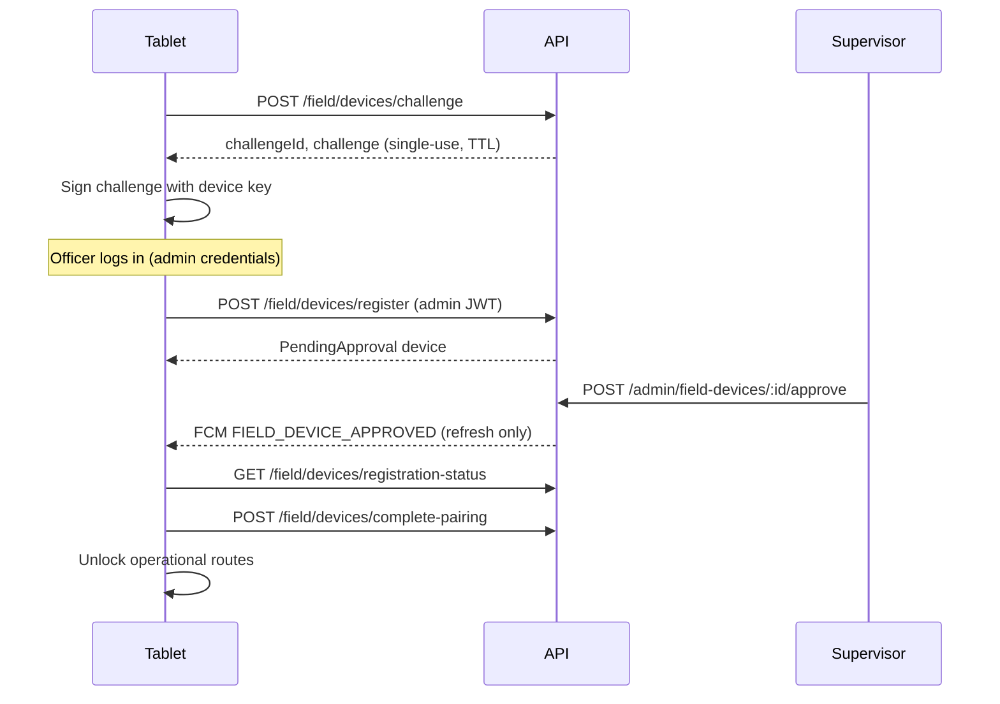

# Field Device Registration

**Project:** THE EYE — Phase 7 Sprint 1

---

## Flow

---

## Endpoints

| Method | Path | Auth | Purpose |
|--------|------|------|---------|
| POST | `/v1/field/devices/challenge` | None | Issue single-use challenge |
| POST | `/v1/field/devices/register` | Admin JWT + `field:device:register` | Submit device registration |
| GET | `/v1/field/devices/registration-status` | Query params | Poll registration state |
| POST | `/v1/field/devices/complete-pairing` | Device signature | Finalize pairing after approval |
| POST | `/v1/field/devices/:publicDeviceId/heartbeat` | Field JWT (optional pre-auth) | Telemetry |

---

## Registration payload (safe metadata)

- `publicKey` (Ed25519, base64)
- `installationIdHash` (SHA-256 of installation fingerprint)
- `serialHash` (optional, hashed)
- `deviceName`, `manufacturer`, `model`
- `androidVersion`, `appVersion`, `buildNumber`, `packageName`
- `challengeId`, `challenge`, `challengeSignature`

---

## Status lifecycle

`PendingApproval` → `Active` | `Retired` (rejected)  
`Active` → `Suspended` | `Lost` | `Revoked` | requires re-pair  
`Suspended` → `Active` (restore)

---

## Replay prevention

Challenges stored as `challengeHash`, consumed on use, expire within minutes.

---

## Push notification policy

Approval push (`FIELD_DEVICE_APPROVED`) triggers **registration status refresh only**. Push is not authorization.
