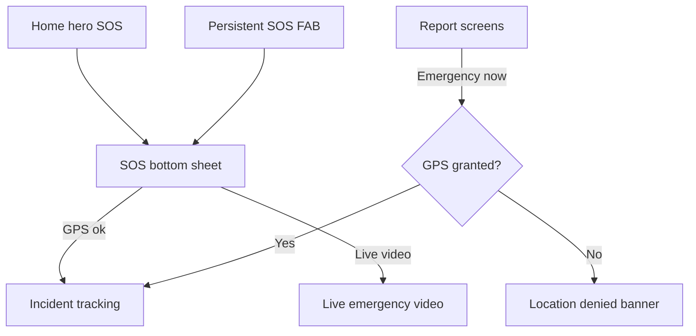

# THE EYE — Mobile UX Report

**Date:** 2026-07-10  
**Reviewer role:** Senior Mobile UX Designer  
**App:** `apps/mobile` (Flutter 3.5, single `main.dart`)  
**Figma source:** [THE EYE (Copy)](https://www.figma.com/design/ZxyNNxUzsx3DiGjRwrCopr/THE-EYE--Copy-) node `0:1`  
**Principle:** No redesign — preserve Figma layout, colors, and hierarchy; improve usability only

---

## Executive summary

The Flutter citizen app delivers a **Figma-aligned emergency-first experience** with persistent SOS access, seven report types, live video placeholder, smartwatch companion, and neighborhood watch modules. Brand tokens (`#009933`, `#FF9933`, Montserrat) are applied globally.

**Strengths:** Clear emergency hierarchy (hero + FAB + bottom sheet), 64dp SOS FAB, Montserrat typography, high-contrast accessibility toggle, offline draft concept, verification badges on tracking.

**Gaps before this pass:** Silent failures on submit, no GPS on SOS sheet, dead attachment chips, undersized auth buttons (46dp), no dark theme, inconsistent error feedback, no loading states on critical paths.

**Improvements applied:** Shared location/error helpers, SOS GPS capture, form validation, loading indicators, snackbar feedback, offline banner, location settings CTA, dark theme (system), 48dp touch targets, back navigation.

---

## Evaluation matrix

| Area | Before | After | Score |
|------|--------|-------|-------|
| Emergency workflow | SOS sent without GPS; no confirmation | GPS required for SOS; snackbar + tracking redirect | **B+** |
| Navigation | No back button; bottom nav always replaced | Back when stack allows; skip redundant nav taps | **B** |
| Accessibility | Partial Semantics; 46dp auth buttons | 48dp min targets; SOS/header semantics; high contrast kept | **B** |
| Touch targets | Auth 46dp; chips untested | Theme enforces 48dp icon/text buttons; ActionTile min 88dp | **B+** |
| GPS permissions | Generic denial text | Granular messages + Open settings CTA | **A-** |
| Camera flow | Dead chips; placeholder stream | Chips give clear feedback; stream start shows loading | **C+** |
| Offline experience | Toggle only in settings | Report offline banner + SOS offline message + draft list | **B** |
| Loading states | Smartwatch only | Report, SOS, live video stream start | **B** |
| Animations | Theme rebuild only | Unchanged (acceptable for safety app) | **C** |
| Forms | No validation | Description required for non-emergency reports | **B-** |
| Error handling | Status text only | Snackbars + inline field errors + banners | **B+** |
| Typography | Montserrat global; auth hardcoded sizes | Preserved Figma auth sizing; theme elsewhere | **A-** |
| Spacing | Consistent 16px / 120px FAB padding | Preserved | **A-** |
| Dark mode | Not supported | `ThemeMode.system` + dark palette (`#111820`) | **B** |
| Consistency | Mixed greens (`#0B7E5D` auth vs `#009933` app) | Intentional Figma auth vs app tokens — documented | **B** |

---

## 1. Emergency workflow

### Current flow



### Findings

| Item | Assessment |
|------|------------|
| SOS always visible | **Good** — 64dp center FAB on every `SafetyScaffold` screen |
| Emergency hero on home | **Good** — dark card matches Figma emergency prominence |
| GPS on SOS | **Was missing** — now captured before send |
| Confirmation | **Improved** — snackbar confirms online/offline send |
| Live video path | **Good** — SOS sheet offers video branch |
| API wiring | **Pending** — local `submitDraft` only (documented TODO) |

### Improvements applied

- `_SosBottomSheet` with async GPS capture, loading state, and feedback
- Emergency report blocks submit when GPS denied (with settings CTA)
- Urgent "Send emergency now" shows spinner while processing

---

## 2. Navigation

### Structure

| Pattern | Routes |
|---------|--------|
| Bottom nav (5 tabs) | Home, Police, Tracking, Family, Profile |
| Deep links | 25+ named routes (reports, NW, smartwatch, etc.) |
| Auth gate | Splash → Login → OTP → Home |

### Findings

| Issue | Severity | Resolution |
|-------|----------|------------|
| No back from deep screens | Medium | AppBar back when `canPop` |
| Bottom nav clears stack | Low | Skip `pushReplacement` if already on tab |
| NW/Broadcasts not in bottom nav | Info | By Figma design — accessed from home grid |
| `pushReplacementNamed` on tabs | Low | Acceptable for tab pattern |

---

## 3. Accessibility

| Control | Status |
|---------|--------|
| SOS FAB | `Semantics(label: "Send SOS emergency alert")` |
| Action tiles | Per-tile `Semantics(button, label)` |
| Splash | `Semantics(label: "Loading THE EYE")` |
| SOS sheet header | `Semantics(header: true)` |
| Attachment chips | `Semantics(label: "Attach {type} evidence")` |
| High contrast mode | Settings toggle — increases contrast for stress/bright light |
| Screen reader on forms | Partial — field errors now exposed via `errorText` |

### WCAG-oriented notes

- Minimum touch target theme: **48×48dp** for icon and text buttons
- Primary actions (FilledButton): **56dp** height via theme
- SOS FAB: **64dp** — exceeds 44dp minimum
- Color contrast: P1 alerts use red on light pink — verify in high contrast mode

---

## 4. Touch targets

| Element | Size | Pass |
|---------|------|------|
| SOS FAB | Full width − 32, height 64 | ✅ |
| FilledButton (theme) | 56dp | ✅ |
| Auth Continue/Verify | 48dp (was 46dp) | ✅ |
| ActionTile | min 88dp height | ✅ |
| IconButton (settings) | 48dp min | ✅ |
| Attachment chips | OutlinedButton — inherits 56dp theme | ✅ |
| Forget Password link | TextButton 48dp min | ✅ |

---

## 5. GPS permissions

### Implementation

Shared `captureLocationOutcome()` distinguishes:

| Result | User message |
|--------|--------------|
| `serviceDisabled` | Turn on location services |
| `denied` | Permission required for emergencies |
| `deniedForever` | Blocked — open settings |
| `granted` | Proceed |

### Surfaces using GPS

| Screen | Behavior |
|--------|----------|
| SOS bottom sheet | Required before send |
| Emergency report | Required for "Send emergency now" |
| Live video | Required to start stream; 5s updates while streaming |
| Smartwatch SOS/GPS | Required; banner + settings CTA |

### `LocationDeniedBanner`

Reusable component with **Open location settings** action via `Geolocator.openAppSettings()`.

---

## 6. Camera / evidence flow

| Step | Current state |
|------|---------------|
| Attachment picker UI | Photo / Video / Audio chips |
| Tap feedback | Snackbar explains API/camera wiring pending |
| Live video preview | Placeholder (LiveKit not integrated) |
| Stream controls | Start/stop with loading state |
| Low-data mode | Compress message shown on picker |

**Recommendation (future):** Wire `image_picker` / `camera` with permission rationale dialog matching Figma evidence card.

---

## 7. Offline experience

| Feature | Status |
|---------|--------|
| Offline toggle (Settings) | Simulated — not connectivity-aware |
| Offline drafts list | Shown on Incident tracking |
| Report offline banner | **Added** on report screens |
| SOS offline message | **Added** via snackbar |
| Auto-sync on reconnect | Clears drafts + notification (simulated) |

**Recommendation (future):** Replace manual toggle with `connectivity_plus` and queue retry worker.

---

## 8. Loading states

| Action | Indicator |
|--------|-----------|
| SOS send | Button spinner + disabled actions |
| Report submit | Button spinner |
| Live video start | "Starting stream..." + spinner |
| Smartwatch API calls | `sending` disables buttons + status text |
| Splash | Brand lockup (no spinner — acceptable) |

**Not added:** Skeleton loaders (low priority for safety flows where explicit feedback is preferred).

---

## 9. Animations

| Type | Present |
|------|---------|
| Theme transition | `AnimatedBuilder` on controller |
| Page transitions | Default Material |
| SOS sheet | `showDragHandle: true` |
| Micro-interactions | InkWell ripples on tiles |

**Assessment:** Appropriate restraint for an emergency app — motion does not delay critical actions.

---

## 10. Forms

| Form | Validation |
|------|------------|
| Login / OTP | None (prototype — navigates forward) |
| Report (non-emergency) | Description required |
| Report (emergency) | Description optional; GPS required for urgent send |
| Broadcast forms | No controllers — prototype only |
| NW create post | No validation — prototype |

**Improvements:** `errorText` on description field; helper text clarifies emergency optional description.

---

## 11. Error handling

| Pattern | Usage |
|---------|-------|
| `showAppSnackBar` | Success (green) / error (red) floating snackbars |
| `LocationDeniedBanner` | Persistent GPS errors with recovery action |
| `OfflineStatusBanner` | Contextual offline warning on reports |
| Inline `errorText` | Form field validation |
| Smartwatch status line | Retained for device operations |

---

## 12. Typography

| Token | Usage |
|-------|-------|
| Montserrat | Global via `GoogleFonts.montserratTextTheme()` |
| `headlineSmall` / `titleLarge` | w800 — section headers |
| Auth card | 28px w700 "Welcome Back" — matches Figma |
| Body secondary | `#5C6670` for metadata |
| Command text | `BrandColors.command` (`#032221`) |

**Note:** Auth screens use `#0B7E5D` button green per Figma login frame; app chrome uses `#009933` — intentional, not a regression.

---

## 13. Spacing

| Pattern | Value |
|---------|-------|
| Screen horizontal padding | 16px |
| Bottom scroll padding | 120px (clears SOS FAB) |
| Card internal padding | 16px |
| Grid gap | 12px |
| Section gaps | 14–16px |
| Auth card padding | 24–32px |

Consistent with Figma mobile rhythm.

---

## 14. Dark mode

**Added** `buildDarkTheme()` with:

- Scaffold/surface: `#111820` (matches splash + emergency hero)
- Primary: `#009933`, secondary: `#FF9933`
- Input fill: `#1A242E`
- `ThemeMode.system` respects OS preference

Cards remain white in light mode; dark theme adjusts scaffold and inputs — no layout change.

---

## 15. Consistency

| Element | Consistent? |
|---------|-------------|
| Card radius (16–18px) | ✅ |
| Border `#D8DEE4` | ✅ |
| Brand green/orange | ✅ in app chrome |
| Action tile colors | Varied by category (Figma grid) |
| Bottom nav labels | ✅ |
| Verification badges | ✅ green/orange/red |

---

## Usability improvements applied (this review)

| # | Change | File |
|---|--------|------|
| 1 | `captureLocationOutcome()` + failure messages | `main.dart` |
| 2 | `showAppSnackBar()` feedback helper | `main.dart` |
| 3 | `LocationDeniedBanner` + `OfflineStatusBanner` | `main.dart` |
| 4 | SOS sheet: GPS, loading, snackbar, drag handle | `main.dart` |
| 5 | Report: validation, loading, offline banner | `main.dart` |
| 6 | Live video: stream loading, improved permission UX | `main.dart` |
| 7 | Dark theme + system mode | `main.dart` |
| 8 | 48dp touch targets (theme) | `main.dart` |
| 9 | Auth buttons 48dp | `main.dart` |
| 10 | AppBar back navigation | `main.dart` |
| 11 | Attachment chip tap feedback | `main.dart` |
| 12 | Smartwatch API snackbar feedback | `main.dart` |

---

## Remaining UX debt (no redesign)

| ID | Item | Priority |
|----|------|----------|
| UX-01 | Real connectivity detection vs manual toggle | P1 |
| UX-02 | Camera/image_picker integration | P1 |
| UX-03 | LiveKit video player in preview area | P1 |
| UX-04 | Login/OTP form validation | P2 |
| UX-05 | Haptic feedback on SOS long-press | P2 |
| UX-06 | Reduce `main.dart` monolith for UX iteration | P2 |
| UX-07 | Lottie or subtle SOS pulse on hero (optional) | P3 |
| UX-08 | VoiceOver journey test on physical device | P1 |

---

## Build verification

| Command | Result |
|---------|--------|
| `node scripts/mobile-smoke-test.cjs` | **PASS** |
| `flutter pub get` | **SKIPPED** — Flutter SDK not in PATH on this machine |
| `flutter analyze` | **SKIPPED** — Flutter SDK not in PATH |
| `flutter build apk --debug` | **SKIPPED** — Flutter SDK not in PATH |

To verify locally:

```powershell
cd "C:\Users\USER\Documents\the eye 2\apps\mobile"
flutter pub get
flutter analyze
flutter build apk --debug
```

---

## Screen inventory (39 routes)

| Category | Routes |
|----------|--------|
| Auth | `/`, `/login`, `/otp-verification` |
| Core | `/home`, `/settings`, `/profile`, `/family` |
| Emergency | `/report/*` (7), `/live-video`, `/tracking` |
| Broadcasts | `/broadcasts`, `/missing-person`, `/stolen-vehicle` |
| Safety | `/police-stations`, `/notifications`, `/smartwatch` |
| NW | `/neighborhood-watch` + 9 sub-routes |

---

## Recommendations for next sprint

1. **Wire incident API** — replace `submitDraft` with `POST /v1/incidents/report` and show real assignment status.
2. **Connectivity package** — auto-detect offline; remove manual toggle from production builds.
3. **Permission rationale screens** — one-time explainer before first GPS/camera request (Figma copy).
4. **Feature module split** — `lib/features/emergency/`, `auth/`, `smartwatch/` for faster UX iteration without touching emergency flows.
5. **Device testing matrix** — small phone (320dp), large phone, TalkBack, dark mode, low-data mode.

---

*Report generated as part of THE EYE mobile UX review. No visual redesign performed.*
