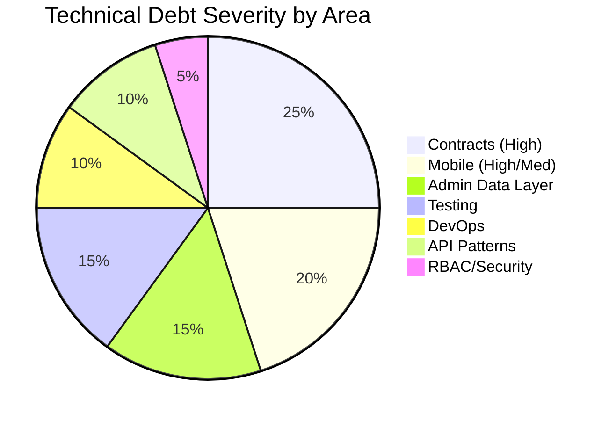

# THE EYE — Technical Debt Report

**Date:** 2026-07-10  
**Context:** Principal architecture review (no new features)

---

## Debt register

| ID | Category | Severity | Item | Impact | Recommendation |
|----|----------|----------|------|--------|----------------|
| TD-01 | Contracts | **High** | Three enum sources: `@the-eye/shared`, Prisma schema, `admin-views.ts` | Drift, mapping bugs | Shared as canonical; mappers only in admin |
| TD-02 | Contracts | **High** | Mobile outside monorepo; no shared types | Breaking API changes undetected | **Resolved** — see `docs/TD-02_COMPLETION_REPORT.md` |
| TD-03 | Architecture | **High** | `main.dart` monolith (~2200 lines) | Unmaintainable mobile client | Split by feature module |
| TD-04 | Data layer | **High** | Admin hybrid: API + mock + placeholders | Production nav shows non-functional pages | **Resolved** — see `docs/TD-04_COMPLETION_REPORT.md` |
| TD-05 | DevOps | **Medium** | Docker uses `npm install`; dev uses `pnpm` | Lockfile divergence in containers | Migrate Dockerfiles to pnpm |
| TD-06 | Testing | **Medium** | Jest configured but custom runner used | Confusing tooling | Remove Jest or adopt it fully |
| TD-07 | Testing | **Medium** | Integration tests grep source files | False confidence | Add supertest e2e against running API |
| TD-08 | Async | **Medium** | Only `notifications` queue exists | Docs overstated scope | **Fixed** in architecture.md |
| TD-09 | API design | **Medium** | Inconsistent DTO validation (class-validator vs manual) | Security inconsistency | Standardize on class-validator + pipes |
| TD-10 | API design | **Medium** | `@Global() PrismaModule` | Domain boundary leaks | Repository pattern per module |
| TD-11 | Security | **Medium** | Admin `withToken()` silent empty fallback on 401 | Hidden auth failures | Surface auth errors to UI |
| TD-12 | Security | **Low** | Auth cache in-memory only | No cross-instance cache | Redis cache at scale |
| TD-13 | RBAC | **Medium** | Admin nav ACL client-side only | Bypass via direct URL | Server-side route guards |
| TD-14 | RBAC | **Low** | `Community Moderator` missing from shared `AdminRoleName` | Permission drift | **Fixed** this review |
| TD-15 | Duplication | **Low** | `roleScope` duplicated in mock-data | DRY violation | **Fixed** — re-export from admin-views |
| TD-16 | Guards | **Low** | JwtAuthGuard duplicated in 10 modules | Boilerplate | Extract `AuthGuardsModule` |
| TD-17 | Mobile | **Medium** | Unused deps: livekit, maps, firebase | Bundle bloat | Wire or remove |
| TD-18 | Mobile | **Medium** | Report submit uses local mock only | No real incident API | Wire `POST /v1/incidents/report` |
| TD-19 | Admin UX | **Low** | Live video always shows first session | Poor multi-session UX | **Fixed** — session picker added |
| TD-20 | Observability | **Low** | `/metrics` outside `/v1` prefix | Inconsistent routing | Document as intentional |
| TD-21 | Build | **Low** | No Turborepo caching | Slower CI at scale | Add when >4 packages |
| TD-22 | Docs | **Low** | Architecture doc overstated async queues | Misleading ops planning | **Fixed** |
| TD-23 | Build | **Low** | UTF-8 BOM in `packages/shared/package.json` | Next.js webpack JSON parse failure | **Fixed** — rewrite without BOM |

---

## Debt by subsystem

---

## Resolved in this review

| ID | Resolution |
|----|------------|
| TD-08 | `docs/architecture.md` corrected — only notifications queue implemented |
| TD-14 | `CommunityModerator` added to `AdminRoleName` + `adminRolePermissions` |
| TD-15 | `mock-data.ts` re-exports `roleScope` from `admin-views.ts` |
| TD-01 (partial) | `admin-views.AdminRole` now aliases `AdminRoleName` from shared |
| TD-23 | Removed UTF-8 BOM from `packages/shared/package.json` (blocked admin-web build) |
| TD-02 | Mobile contract sharing: shared manifest, Dart mirrors, API client, CI tests |

---

## Risk heat map

| Area | Likelihood of pain | Time to fix | Priority |
|------|-------------------|-------------|----------|
| Mobile monolith | High | 2–3 sprints | P1 |
| Enum drift | Medium | 1 sprint | P1 |
| Mock admin pages | Medium | 1–2 sprints | P2 |
| Docker npm/pnpm | Low (until deploy fails) | 2 days | P2 |
| No OpenAPI client | Medium | 1 sprint | P2 |
| Guard duplication | Low | 3 days | P3 |
| Jest vs custom runner | Low | 1 day | P3 |

---

## Long-term maintainability recommendations

### Governance

1. **Contract-first changes** — any API enum change must update `@the-eye/shared` first, then Prisma migration, then admin mappers.
2. **ADR folder** — add `docs/adr/` for architectural decisions (queue strategy, map SDK choice).
3. **Definition of Done** — new admin pages require API endpoint or explicit `placeholder` flag in nav.

### Engineering standards

4. **Module template** — NestJS generator script: module + service + controller + dto + spec.
5. **Admin page template** — `fetchX()` in `data.ts` + mapper + typed view model.
6. **Mobile module convention** — `lib/features/<name>/` before adding screens.

### Quality gates

7. **CI expansion** — add admin TypeScript strict check (already via build), contract test comparing shared enums to Prisma.
8. **Smoke test expansion** — validate admin imports from `@the-eye/shared` for role enums.
9. **k6 in staging** — run `test:load:scale:100` before major releases.

### Scalability path

10. **Queue expansion** — when broadcast volume grows, extract `broadcasts` queue before synchronous fanout becomes bottleneck.
11. **Read path separation** — incident list/dashboard queries via read replica through PgBouncer.
12. **CDN for evidence** — presigned URLs already scoped; add CloudFront when multi-region.

---

## Build verification

Post-refactor run (2026-07-10, after BOM fix):

| Command | Result |
|---------|--------|
| `pnpm install` | **PASS** |
| `pnpm run build` | **PASS** (shared + api + admin-web; 39 app routes) |
| `pnpm run test:backend` | **PASS** (88/88) |
| `pnpm run test:integration` | **PASS** (backend + mobile smoke + admin smoke + docker smoke + env) |

---

## Estimated debt paydown

| Phase | Duration | Items |
|-------|----------|-------|
| Sprint 1 | 2 weeks | TD-01, TD-14, TD-15 (done), TD-04 placeholders audit |
| Sprint 2 | 2 weeks | TD-02 mobile contract, TD-18 report API wire |
| Sprint 3 | 2 weeks | TD-03 main.dart split, TD-17 dep cleanup |
| Sprint 4 | 1 week | TD-05 Docker pnpm, TD-06 test runner unify |
| Ongoing | — | TD-07 integration tests, TD-10 repository pattern |

**Total estimated effort to reach "low debt":** ~8–10 engineering weeks (not blocking current operations).
