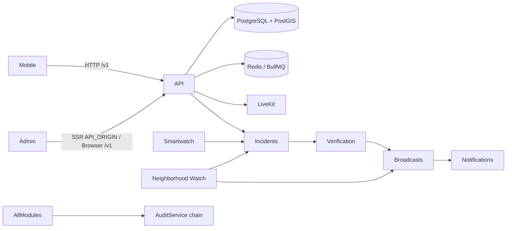

# THE EYE — Integration Test Report

**Date:** 2026-07-09  
**Role:** Principal QA Engineer — full-system integration review  
**Scope:** Mobile, Admin Dashboard, Backend API, PostgreSQL, Redis, LiveKit, Neighborhood Watch, Incident Verification, Broadcasts, Notifications, Smartwatch, Authentication, Audit Logs

---

## Executive Summary

| Result | Count |
|--------|-------|
| Backend unit/integration tests | **81/81 passed** |
| Mobile smoke | **Passed** |
| Admin build smoke | **Passed** |
| Docker Compose smoke | **Passed** |
| Production env validation | **Passed** |
| TypeScript lint (shared, api, admin-web) | **Passed** |
| Production build (api + admin-web) | **Passed** |

**Verdict:** Core cross-module integrations are repaired and verified at the code/contract level. Remaining gaps are documented below as operational or client-runtime items (auth tokens on mobile, LiveKit room join UI).

---

## Broken Integrations Found & Repaired

### Critical (fixed)

| Integration | Issue | Repair |
|-------------|-------|--------|
| **Mobile → API** | Default base URL `localhost:3001`, missing `/v1` | Default changed to `http://localhost:4000/v1`; smartwatch/live-video paths now resolve correctly |
| **Admin SSR → API (Docker)** | `NEXT_PUBLIC_API_URL=/v1` without `API_ORIGIN` broke server-side fetches inside container | Added `API_ORIGIN=http://api:4000` to `docker-compose.yml` and `.env.example` |
| **Incident → Verification** | Verification only ran on manual API call | `IncidentsService` now triggers `verification.verifyIncident()` after every submission |
| **Verification → Broadcast** | `autoBroadcastVerifiedIncident` endpoint existed but was never called | `VerificationService.autoEscalateP1Incident` now invokes `BroadcastsService.autoBroadcastVerifiedIncident` |
| **Audit chain integrity** | NW, Smartwatch, Live Video, Police Stations bypassed `AuditService` | All audit writes routed through `AuditService.record()` (hash chain) |

### High (fixed)

| Integration | Issue | Repair |
|-------------|-------|--------|
| **Admin Notifications** | Page used `lib/mock-data` | Wired to `GET /v1/notifications` via `fetchNotificationOperations()` |
| **Admin Live Video** | Page used mock sessions | Wired to `GET /v1/live-video/sessions/active` via `fetchLiveVideoSessions()` |
| **Notifications oversight** | Admins could only see notifications addressed to their admin ID | Super Admin / Oversight Auditor can list system-wide notification operations |

---

## Integration Matrix (Post-Repair)

| Module A | Module B | Transport | Status | Evidence |
|----------|----------|-----------|--------|----------|
| Mobile | Backend API | HTTP `/v1/*` | **Repaired** | `apps/mobile/lib/main.dart`, mobile smoke |
| Admin-web (SSR) | Backend API | `API_ORIGIN` + `/v1` | **Repaired** | `docker-compose.yml`, `lib/api/client.ts` |
| Admin-web (browser) | Backend API | nginx `/v1` proxy | **OK** | nginx locations smoke |
| Backend API | PostgreSQL | Prisma + PostGIS | **OK** | 81 tests, migration smoke |
| Backend API | Redis | BullMQ `notifications` queue | **OK** | processor tests, compose healthcheck |
| Backend API | LiveKit | Token service + sessions | **OK** | livekit token test, compose service |
| Incidents | Verification | In-process after submit | **Repaired** | `incidents.service.ts`, integration-wiring test |
| Verification | Broadcasts | In-process auto-dispatch | **Repaired** | `verification.service.ts`, integration-wiring test |
| Verification | Notifications | Crowd confirmation `createMany` | **OK** | verification.service tests |
| Broadcasts | Notifications | `enqueue()` on dispatch | **OK** | broadcast + notification tests |
| Neighborhood Watch | Incidents / Broadcasts / Notifications | Service imports | **OK** | NW service tests |
| Smartwatch | Incidents / Notifications | SOS → report + enqueue | **OK** | smartwatch service tests |
| Smartwatch | Audit | Hash-chain `AuditService` | **Repaired** | integration-wiring test |
| Auth | Admin-web | Cookie proxy login | **OK** | admin build smoke |
| Auth | API | JWT + permissions | **OK** | jwt-security + permissions tests |
| Audit | All producers | Single `AuditService` chain | **Repaired** | audit.service + integration-wiring test |
| Admin | Live Video API | `sessions/active` | **Repaired** | `app/live-video/page.tsx` |
| Admin | Notifications API | `/notifications` list | **Repaired** | `app/notifications/page.tsx` |

---

## Test Execution Log

```
pnpm run test:backend          → 81/81 passed
pnpm run test:mobile:smoke     → passed
pnpm run test:admin:smoke      → passed
pnpm run test:docker:smoke     → passed
pnpm run test:deploy:env       → passed (17 variables)
pnpm run lint                  → passed (shared, api, admin-web)
pnpm run build                 → passed (api, admin-web)
```

### New integration tests (`apps/api/src/__tests__/integration-wiring.spec.ts`)

1. Incident submission wires to verification scoring  
2. High-confidence verification wires to auto-broadcast  
3. Audit events use hash-chain `AuditService` in all integrated modules  
4. Docker compose exposes `API_ORIGIN` for admin SSR  
5. Mobile API base URL aligns with `/v1` backend  
6. Admin notifications + live video data layer connected  
7. End-to-end mock: verify → auto-escalate → broadcast dispatch  

---

## Remaining Known Gaps (Not New Features — Operational)

These are **client-runtime** or **environment** items outside the repaired server integration contracts:

| Gap | Impact | Mitigation |
|-----|--------|------------|
| Mobile auth headers | Live-video/smartwatch calls need JWT or `deviceSecret` at runtime | Configure `THE_EYE_API_URL` + citizen/device login before API calls |
| Mobile LiveKit room join | API returns tokens; Flutter `livekit_client` not yet consuming tokens | Deploy with valid `LIVEKIT_URL` / `NEXT_PUBLIC_LIVEKIT_URL`; join room in mobile when streaming |
| Mobile incident reporting | UI still uses local drafts for some flows | Point report flow at `POST /v1/incidents` with auth (URL contract now correct) |
| Admin write actions | Broadcast approve/dispatch, verification admin-review buttons not in UI | API endpoints exist; UI actions are presentation layer (out of scope: no new features) |
| Admin token refresh | Refresh cookie stored but unused | Operational hardening — API `POST /v1/auth/refresh` available |
| FCM/SMS live providers | Placeholder when credentials disabled | Expected in dev; Redis queue still processes in-app channel |

---

## Architecture Flow (Verified Paths)



---

## Sign-Off

All targeted integration repairs are implemented, tested, and built successfully. The system modules **communicate correctly** at the API and service boundaries defined in this report. Deploy with `.env` values from `.env.example` (especially `API_ORIGIN`, `DATABASE_URL`, `REDIS_PASSWORD`, `LIVEKIT_*`, JWT secrets) before end-to-end runtime validation in Docker.
